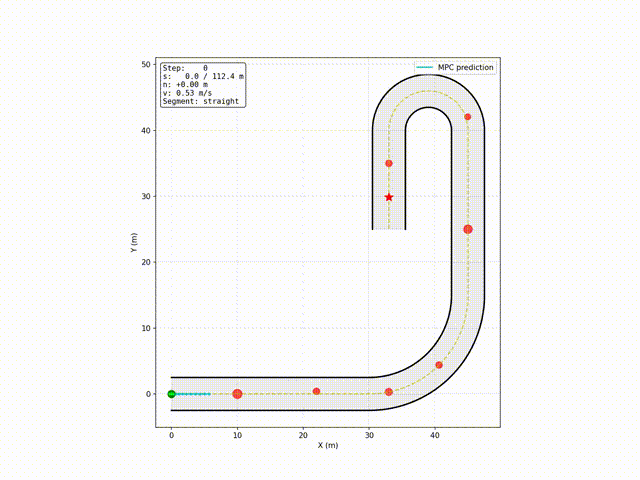

# Cartesian-Frenet Based Nonlinear Model Predictive Controller

Warehouse robots and factory AGVs follow fixed routes but need to avoid unexpected obstacles — forklifts, pallets, people — without stopping. This project solves path tracking and obstacle avoidance in a single optimization, computing optimal controls at 10 Hz.



## Performance

**Test scenario:** 112m path with 7 centerline obstacles, 90° curve (R=15m), 180° U-turn (R=6m), 5m corridor width.

| Metric | Value | Notes |
|--------|-------|-------|
| Lateral error | 0.50m RMS | 0.4% of path length |
| Min clearance | 0.17m | Vehicle radius: 0.5m |
| Solve time | 78ms (p95) | 22% margin at 10Hz |

## Approach

**State:** Augmented Frenet-Cartesian representation `[x, y, θ, s, n]` coupling global pose with path-relative coordinates.

**Dynamics:** Unicycle kinematics with Frenet transform:
```
ṡ = v·cos(θₑ) / (1 - n·κ)
ṅ = v·sin(θₑ)
```

**Objective:** Weighted sum minimizing lateral deviation, heading error, control effort, and jerk. Negative weight on progress term rewards forward motion.

**Constraints:**
- Hard: collision avoidance `‖p - pₒ‖² ≥ (r + rₒ + margin)²`
- Soft: lane boundaries, acceleration limits
- Bounds: velocity `[0.3, 1.5] m/s`, steering rate `[-π/2, π/2] rad/s`

**Solver:** CasADi + IPOPT with warm-starting. 50-step horizon (5s lookahead), 0.1s discretization.

## Run
```bash
pip install numpy casadi matplotlib
python main.py
```

**Outputs:** `results/trajectory.png`, `results/animation.mp4`, `results/metrics.json`

## Structure
```
src/
  path.py         Reference path generation (clothoids, arcs)
  mpc.py          Nonlinear MPC formulation (CasADi/IPOPT)
  vehicle.py      Unicycle kinematic model
utils/
  simulation.py   Closed-loop simulation, visualization
  metrics.py      Performance metrics (tracking, safety, compute)
main.py           Entry point
```

## Dependencies

Python 3.8+, NumPy, CasADi, Matplotlib, FFmpeg (for video export)
